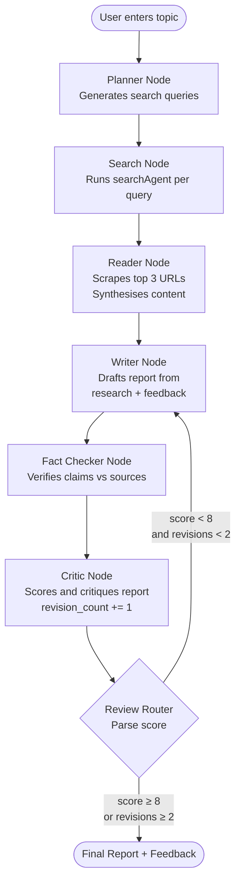
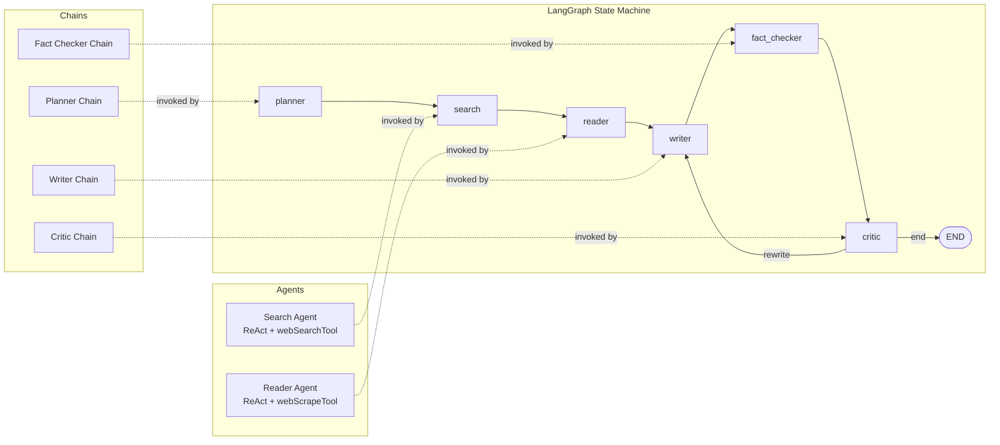

# 🔍 Multi Agent Research Tool

An autonomous, multi-agent research pipeline powered by **LangGraph** and **LangChain**. Given a topic, the system plans searches, retrieves and scrapes web content, writes a structured report, fact-checks it, and iteratively improves it via a critic loop — all without human intervention.

---

## Overview

Most LLM-based research tools stop at retrieval. This project goes further: it orchestrates a full editorial pipeline. A **Planner** decomposes the topic into targeted queries, a **Search Agent** gathers live results, a **Reader Agent** scrapes and synthesises the most relevant pages, a **Writer** composes a report, a **Fact-Checker** cross-references claims against source material, and a **Critic** scores the report and drives rewrites until a quality threshold is met.

The result is a fully automated research assistant that produces citation-grounded, reviewed, and refined reports on any topic.

---

## Features

- **Autonomous multi-step research** — plan → search → scrape → write → fact-check → critique → rewrite
- **Intelligent query planning** — LLM-generated search queries tailored to the topic
- **Live web search** — real-time retrieval via a search tool agent
- **Deep content extraction** — selective URL scraping with deduplication and synthesis
- **Structured report generation** — LLM-authored reports with integrated research context
- **Automated fact-checking** — claim verification against scraped source material
- **Iterative critic loop** — scored feedback drives rewrites until quality ≥ 8/10 or max revisions hit
- **LangGraph state machine** — robust, traceable graph-based orchestration with conditional branching

---

## Tech Stack

| Layer | Technology |
|---|---|
| Orchestration | LangGraph `>=1.2.4` |
| LLM Framework | LangChain `>=1.3.4` · LangChain-Community `>=0.4.2` · LangChain-Core `>=1.4.1` |
| LLM Providers | LangChain-OpenAI `>=1.2.2` · LangChain-Groq `>=1.1.2` · LangChain-OpenRouter `>=0.2.3` |
| Web Search | Tavily Python `>=0.7.25` |
| Web Scraping | Requests `>=2.34.2` · BeautifulSoup4 `>=4.14.3` |
| UI | Streamlit `>=1.58.0` |
| CLI Output | Rich `>=15.0.0` |
| Package Manager | `uv` |
| Runtime | Python 3.11+ |
| Config | `pyproject.toml` + `.env` · python-dotenv `>=1.2.2` |

---

## Project Architecture

The system is a **directed acyclic graph** with one conditional back-edge. Nodes are pure functions operating on a shared `ResearchState` TypedDict. All inter-node communication happens through state mutations — no node calls another directly.

```
START → planner → search → reader → writer → fact_checker → critic
                                        ↑                        │
                                        └────── rewrite ─────────┘
                                                                  │
                                                                 END (score ≥ 8 or revisions ≥ 2)
```

Each node is responsible for one editorial role. The `review_router` function reads the critic's numeric score and either routes back to `writer` (rewrite) or exits to `END`.

---

## Folder Structure

```
.
├── main.py                  # Streamlit application entry point
├── pyproject.toml           # Project metadata and dependencies
├── req.txt                  # Pip-compatible requirements list
├── uv.lock                  # Deterministic lockfile (uv package manager)
├── .python-version          # Pinned Python version
├── .gitignore
│
├── agents/
│   ├── searchAgent.py       # LangGraph ReAct agent — runs web searches
│   ├── readerAgent.py       # LangGraph ReAct agent — scrapes and synthesises URLs
│   └── trendingAgent.py     # Optional agent for trending/news topic discovery
│
├── chains/
│   ├── plannerChain.py      # LLMChain — decomposes topic into search queries
│   ├── writerChain.py       # LLMChain — drafts the research report
│   ├── criticChain.py       # LLMChain — scores and critiques the report
│   └── factCheckerChain.py  # LLMChain — verifies report claims against sources
│
├── pipelines/
│   └── pipeline.py          # Compiled LangGraph StateGraph (research_graph)
│
└── tools/
    ├── webSearchTool.py     # LangChain tool wrapping the search API
    └── webScapeTool.py      # LangChain tool wrapping the scraper
```

---

## Data Flow

```
User Input (topic)
        │
        ▼
  [planner_node]
  plannerChain.invoke({topic})
  → search_queries (newline-separated list)
        │
        ▼
  [search_node]
  For each query → searchAgent.invoke()
  → combined search_results (concatenated agent outputs)
        │
        ▼
  [reader_node]
  readerAgent.invoke(search_results)
  Selects top 3 URLs → scrapes each → deduplicates → summarises
  → scraped_content
        │
        ▼
  [writer_node]
  writerChain.invoke({topic, research, feedback})
  research = search_results + scraped_content
  → report (markdown string)
        │
        ▼
  [fact_checker_node]
  factCheckerChain.invoke({research, report})
  → fact_check (annotated verification notes)
        │
        ▼
  [critic_node]
  criticChain.invoke({report + fact_check})
  → feedback (text with embedded "Score: N/10")
  revision_count += 1
        │
        ▼
  [review_router]
  Parse score from feedback
  score ≥ 8 OR revision_count ≥ 2  →  END
  otherwise                          →  writer_node (rewrite loop)
```

---

## Agent Workflow

### Search Agent (`searchAgent.py`)

A LangGraph **ReAct** agent equipped with the `webSearchTool`.

- **Responsibility**: execute a single search query and return a summary of findings
- **Tool used**: `webSearchTool` — queries Tavily and returns ranked results
- **LLM interaction**: the agent reasons about which results are most relevant and synthesises a coherent answer
- **Called by**: `search_node`, once per query produced by the planner

### Reader Agent (`readerAgent.py`)

A LangGraph **ReAct** agent equipped with the `webScrapeTool`.

- **Responsibility**: given the aggregated search results, select the 3 most relevant URLs, scrape each, and produce a unified research summary
- **Tool used**: `webScrapeTool` — fetches and parses full page content from a URL
- **Decision-making**: the agent autonomously selects URLs based on relevance to the original topic and source credibility
- **Memory handling**: full search results are passed in the prompt context (no persistent memory store)
- **Output**: deduplicated, source-attributed research summary

### Trending Agent (`trendingAgent.py`)

Optional utility agent for topic discovery — can be used to seed the pipeline with trending subjects before invoking the main graph.

---

## Chain Descriptions

| Chain | Prompt Role | Input | Output |
|---|---|---|---|
| `plannerChain` | Research strategist | `{topic}` | Newline-separated search queries |
| `writerChain` | Technical writer | `{topic, research, feedback}` | Markdown research report |
| `factCheckerChain` | Fact-checker | `{research, report}` | Annotated verification notes |
| `criticChain` | Editor / reviewer | `{report, fact_check}` | Feedback text with `Score: N/10` |

All chains are standard `LLMChain` or `LCEL` (LangChain Expression Language) objects. They do not call tools — they are pure LLM inference steps.

---

## System Workflow (End-to-End)



---

## Agent & Graph Flow Diagram



---

## Installation

### Prerequisites

- Python 3.11+
- [`uv`](https://github.com/astral-sh/uv) (recommended) or `pip`
- API keys for your chosen LLM provider and Tavily search

---

### Option A — `uv` (recommended)

`uv` is a fast, modern Python package manager. If you don't have it:

```bash
# Install uv (Windows PowerShell)
powershell -ExecutionPolicy ByPass -c "irm https://astral.sh/uv/install.ps1 | iex"

# Install uv (macOS / Linux)
curl -LsSf https://astral.sh/uv/install.sh | sh
```

```bash
# 1. Clone the repository
git clone https://github.com/ParasP41/Multi-Agent-Research-Tool.git
cd Multi-Agent-Research-Tool

# 2. Create a virtual environment and install all dependencies
uv sync
```

Activate the environment:

```bash
# Windows
.venv\Scripts\activate

# macOS / Linux
source .venv/bin/activate
```

---

### Option B — `pip` + `venv`

```bash
# 1. Clone the repository
git clone https://github.com/ParasP41/Multi-Agent-Research-Tool.git
cd Multi-Agent-Research-Tool

# 2. Create a virtual environment
python -m venv .venv

# 3. Activate it
# Windows
.venv\Scripts\activate
# macOS / Linux
source .venv/bin/activate

# 4. Install dependencies
pip install -r req.txt
```

---

### Dependencies

All dependencies are pinned in `pyproject.toml` and `uv.lock`:

```
beautifulsoup4>=4.14.3      # HTML parsing for web scraper
langchain>=1.3.4            # Core LLM framework
langchain-community>=0.4.2  # Community integrations
langchain-core>=1.4.1       # Shared abstractions
langchain-groq>=1.1.2       # Groq LLM provider
langchain-openai>=1.2.2     # OpenAI LLM provider
langchain-openrouter>=0.2.3 # OpenRouter LLM provider
langgraph>=1.2.4            # Graph-based agent orchestration
python-dotenv>=1.2.2        # .env file loader
requests>=2.34.2            # HTTP client for scraping
rich>=15.0.0                # Pretty terminal output
streamlit>=1.58.0           # Web UI
tavily-python>=0.7.25       # Tavily search API client
```

---

## Environment Variables

Create a `.env` file in the project root:

```env
# LLM Provider — set whichever you use
OPENAI_API_KEY=sk-...
GROQ_API_KEY=gsk_...
OPENROUTER_API_KEY=sk-or-...

# Search
TAVILY_API_KEY=tvly-...

# Optional: LangSmith tracing
LANGCHAIN_TRACING_V2=true
LANGCHAIN_API_KEY=ls__...
LANGCHAIN_PROJECT=multi-agent-research-tool
```

| Variable | Required | Description |
|---|---|---|
| `OPENAI_API_KEY` | One of these three | OpenAI models via `langchain-openai` |
| `GROQ_API_KEY` | One of these three | Groq fast-inference models via `langchain-groq` |
| `OPENROUTER_API_KEY` | One of these three | Any model via OpenRouter proxy |
| `TAVILY_API_KEY` | **Yes** | Powers `webSearchTool` — free tier available at [tavily.com](https://tavily.com) |
| `LANGCHAIN_TRACING_V2` | No | Enable LangSmith trace logging |
| `LANGCHAIN_API_KEY` | No | LangSmith API key |
| `LANGCHAIN_PROJECT` | No | LangSmith project name |

---

## Running the Project

Make sure your virtual environment is active before running either mode.

### Streamlit UI (recommended)

```bash
python -m streamlit run main.py
```

The app opens automatically at `http://localhost:8501` in your browser. Enter a research topic in the input field and click **Run Research**. Progress, intermediate outputs, and the final report are streamed to the UI in real time.

### CLI mode

```bash
python pipelines/pipeline.py
```

You will be prompted interactively:

```
Enter the prompt: The impact of large language models on scientific research in 2024

=== SEARCH PLAN ===
LLM applications in scientific research 2024
Large language models biology chemistry papers
AI-assisted research productivity studies
...

==================================================
FACT CHECK
==================================================
[VERIFIED] LLMs have been applied to protein structure prediction ...
[UNVERIFIED] Claims about 40% productivity gains lack a cited source ...

==================================================
CRITIC FEEDBACK
==================================================
Score: 7/10
The report covers the main themes but lacks specific citation counts...

Rewriting Report...

==================================================
FINAL REPORT
==================================================
# The Impact of Large Language Models on Scientific Research in 2024
...

==================================================
FINAL FEEDBACK
==================================================
Score: 9/10
Significantly improved after revision ...
```
```

---

## Components and Modules

### `main.py`

Streamlit application entry point. The full LangGraph research graph is defined in `pipelines/pipeline.py`.

### `agents/searchAgent.py`

Constructs and returns a compiled LangGraph ReAct agent pre-loaded with `webSearchTool`. Called once per query inside `search_node`.

### `agents/readerAgent.py`

Constructs and returns a compiled LangGraph ReAct agent pre-loaded with `webScrapeTool`. Given the full search results, it autonomously selects URLs to scrape, calls the tool multiple times, and returns a synthesised summary.

### `agents/trendingAgent.py`

Standalone utility agent for discovering trending topics. Not part of the main pipeline but can be used upstream to generate topic candidates.

### `chains/plannerChain.py`

An LLM chain that takes a topic and returns a newline-separated list of targeted search queries. The prompt instructs the model to think like a research strategist and produce diverse, specific queries.

### `chains/writerChain.py`

An LLM chain that takes the topic, combined research, and any critic feedback, and returns a well-structured markdown report. On rewrites, the feedback is injected into the prompt so the model can address specific shortcomings.

### `chains/factCheckerChain.py`

An LLM chain that compares the written report against the source research material, flagging unsupported or inaccurate claims and confirming verified ones.

### `chains/criticChain.py`

An LLM chain that reads the report alongside the fact-check notes and produces structured editorial feedback. Critically, it embeds a `Score: N/10` line that `review_router` parses to decide whether to rewrite or finalise.

### `tools/webSearchTool.py`

A LangChain `Tool` wrapping the Tavily search API. Accepts a query string and returns a formatted list of search results.

### `tools/webScapeTool.py`

A LangChain `Tool` wrapping Requests and BeautifulSoup. Accepts a URL and returns extracted page text, cleaned of navigation and boilerplate.

### `pipelines/pipeline.py`

Contains the compiled `research_graph` (`StateGraph.compile()`). Can be imported by other modules for programmatic use without going through the CLI in `main.py`.

---

## Prompt Engineering

### Planner prompt

Instructs the model to act as a research strategist. It generates exactly 5 specific, diverse queries designed to surface different facets of the subject (background, recent developments, expert opinions, statistics, counterarguments).

### Writer prompt

Takes the full research context plus any feedback from a previous critic pass. On the first pass, `feedback` is an empty string. On rewrites, the model is explicitly instructed to address each point raised by the critic while preserving strong sections.

### Fact-checker prompt

Provides both the source research and the draft report side-by-side. Instructs the model to identify unsupported claims, missing evidence, contradictions, potential hallucinations, and inaccurate statements concisely.

### Critic prompt

Combines the report and fact-check output. Instructs the model to evaluate on five axes: accuracy, depth, structure, readability, and source diversity. It must end the response with a line in the exact format `Score: N/10` to enable deterministic parsing in `review_router`.

---

## ResearchState Schema

```python
class ResearchState(TypedDict):
    topic: str             # The original research topic
    search_queries: str    # Newline-separated queries from the planner
    search_results: str    # Aggregated search agent outputs
    scraped_content: str   # Synthesised reader agent output
    report: str            # Current draft of the report
    fact_check: str        # Fact-checker output for the current draft
    feedback: str          # Critic feedback (including Score: N/10)
    revision_count: int    # Number of critic passes completed
```

All state fields are plain strings except `revision_count`. The entire state is passed to every node; each node returns only the keys it modifies.

---

## Revision Loop Logic

```python
def review_router(state: ResearchState) -> str:
    # Parse "Score: N/10" from critic feedback
    # Falls back to score=5 if parsing fails
    if score >= 8:
        return "end"
    if state["revision_count"] >= 2:
        return "end"       # Safety cap — no infinite loops
    return "rewrite"       # Route back to writer_node
```

The graph guarantees termination: it exits after a score of at least 8 or after two critic passes. With the current counter logic, this permits at most one rewrite.

---

## Contributing

1. Fork the repository
2. Create a feature branch: `git checkout -b feature/your-feature`
3. Commit your changes: `git commit -m "feat: describe your change"`
4. Push and open a pull request

Please ensure new chains and agents follow the existing patterns (chain files export a single `_chain` object; agent files export a factory function returning a compiled graph).

---

## License

MIT — see `LICENSE` for details.